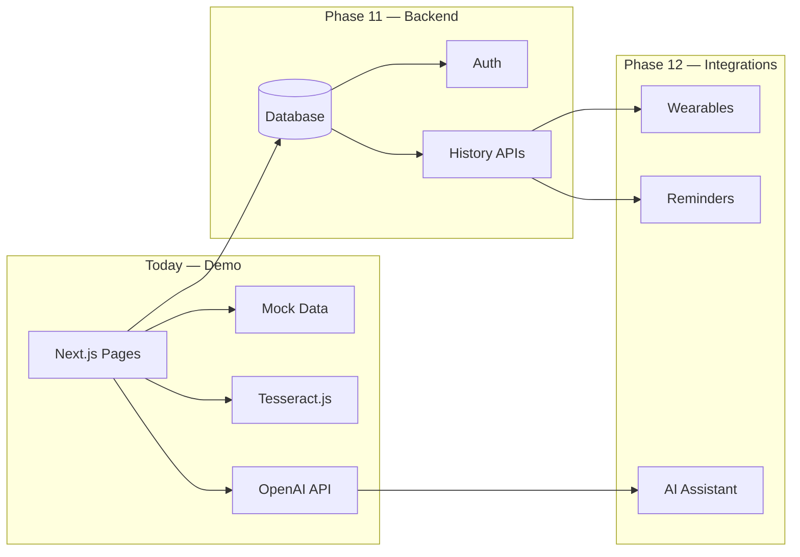

# MediNova-AI — Future Roadmap

Honest product vision after the hackathon demo. **What works today** is documented in the README and feature guides; this file covers **what would come next** if MediNova-AI became a real startup product.

---

## What ships today (hackathon demo)

| Feature | Status | Notes |
|---------|--------|-------|
| AI Symptom Checker | ✅ Live | OpenAI + demo fallback |
| Prescription OCR | ✅ Live | Tesseract.js in browser |
| Smart Medicine Scanner | ✅ Live | Photo AI + manual barcode + mock DB |
| Emergency SOS | ✅ Simulation | Replayable timeline |
| Health Dashboard | ✅ Mock data | Chart.js analytics |
| Health Reports | ✅ Mock data | Filters + expandable cards |
| Dark / light theme | ✅ Live | next-themes |
| Accessibility polish | ✅ Live | Skip link, focus rings, reduced motion |

---

## Phase 11 — Backend & user accounts ✅

**Goal:** Persistence without rebuilding the frontend — **implemented** with cookie sessions and local JSON storage.

| Feature | Status | Route |
|---------|--------|-------|
| User profiles | ✅ Live | `/profile` |
| Symptom history | ✅ Live | Auto-save + `/history` |
| OCR history | ✅ Live | Text preview only |
| Scan history | ✅ Live | Barcode lookups |
| Emergency contacts | ✅ Live | Profile page |

See **[BACKEND.md](./BACKEND.md)** for API reference and demo flow.

**Production upgrade:** Supabase, Firebase, or PostgreSQL + NextAuth.

---

## Phase 12 — Advanced AI & integrations ✅

**Goal:** Differentiate beyond the hackathon MVP — **implemented** as demo integrations on the Phase 11 store.

| Feature | Status | Route |
|---------|--------|-------|
| AI Health Assistant | ✅ Live | `/assistant` |
| Smart medicine reminders | ✅ Live | `/reminders` |
| Doctor appointments | ✅ Live | `/appointments` |
| Wearable sync | ✅ Live | Dashboard + `/api/wearables` |
| Voice assistant | 🔜 Planned | — |
| Risk detection ML | 🔜 Planned | — |
| IoT sensors | 🔜 Future | — |

See **[INTEGRATIONS.md](./INTEGRATIONS.md)** for API reference and demo flow.

---

## Phase 13 — Real-world healthcare integrations

**Goal:** Move from demo to regulated, production-grade product (long-term).

- Real SMS/email via Twilio or SendGrid for emergency alerts
- HIPAA-compliant storage and audit logs
- Integration with EHR / FHIR APIs for lab reports
- Verified medicine databases (FDA, RxNorm) instead of mock barcodes
- Clinician review workflow for AI outputs
- Multi-language support

**Important:** Do not claim HIPAA compliance or real emergency dispatch until legally and technically ready.

---

## Architecture evolution

---

## Recommended build order (post-hackathon)

1. **Deploy to Vercel** — share a live URL with judges ([DEPLOYMENT.md](./DEPLOYMENT.md))
2. **User auth + symptom history** — highest demo-to-product value
3. **Medicine reminders** — connects barcode + OCR flows
4. **AI assistant chat** — extends symptom checker
5. **Wearables** — replaces mock dashboard vitals
6. **Real emergency integrations** — only with legal review

---

## What we will not overpromise

- Medical diagnosis or licensed clinical decision support
- Real emergency dispatch without proper integrations
- Perfect OCR or barcode accuracy without verification UX
- HIPAA compliance without infrastructure investment

---

## Related docs

- [DEMO-SCRIPT.md](./DEMO-SCRIPT.md) — 3-minute presentation flow
- [DEPLOYMENT.md](./DEPLOYMENT.md) — production deploy
- [POLISH-QA.md](./POLISH-QA.md) — accessibility and QA checklist
